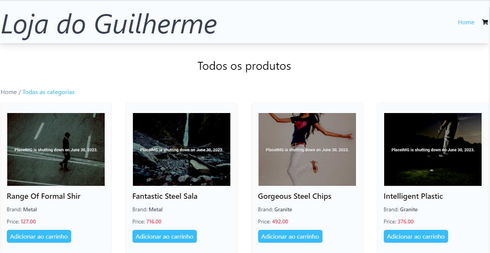
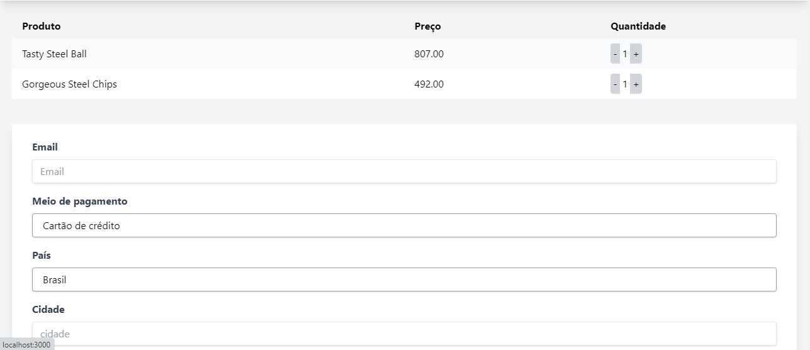

# Projeto de e-commerce e integração de APIs

## Objetivos do projeto

1. Construção do back-end
1.1 Realizar o merge de duas lista de produtos que são recebidos de duas APIs diferentes.
1.2 Receber os itens do pedido, diferenciando a origem dos produtos
1.3 Construir um banco de dados que guarde a relação dos pedidos

2. Construção do front-end
2.1 Listar os produtos
2.2 Contruir um carrinho de compras
2.2 Enviar ao back-end os itens do pedido

## Instruções do deploy

1. Back-end
1.1 Realizar o preenchimento dos arquivos .env
1.2 No laravel é necessário criar um banco de dados e preencher o .env com as credenciais do banco e a APP_KEY
1.3 Executar o comando "composer install"
1.4 Executar o comando "php artisan serve"
2. Front-end
2.1 Preencher o arquivo .env do React, é necessário informar a URL do back-end
2.1 Executar o comando npm install
2.1 Executar o comando npm start

# Referências 

Para facilitar o desenvolvimento, utilizei o template de e-commerce do nasimhelal-cell. Repositório: https://github.com/nasimhelal-cell/itstore

# Stacks

PHP, Laravel, React, Tailwind CSS

# Telas do projeto

